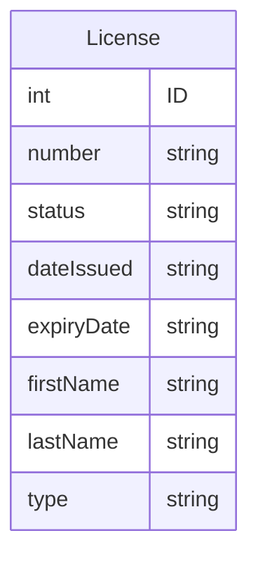

# Find My License / Backend
* **Creators:** Amanda Carpio, Sakinah Freeman, Jean Mayard, Naveen Muralidharan
* **Description:** Our application will allow users to create licenses and update them to our site. The licenses will be visible to everyone and you'll be able to search by license name. Our application will have full CRUD functionality while using a databasse.
* **Technologies Used:** Express.js, Mongoose, React

### Models

### Route Table
| Endpoint | Method | Description |
| -------- | -------- | -------- |
| /findmylicense | GET | brings user to the homepage where they're able to create new license and/or search for one 
| /findmylicense/:id | GET | brings user to a specific license based on their search
| /findmylicense | POST | creates a new license |
| /findmylicense/:id | PUT | updates a specific license based on the ID |
| /findmylicense/:id | DELETE | deletes an ID | 

#### Extras
* We're hoping to add an authentication
* We're going to try and see how we can change dates from being string to actual dates